# Complete Guide: Memory & Agents Creating Dashboards

## 🚨 **SECURITY WARNING**

**⚠️ CRITICAL SECURITY ISSUES IDENTIFIED** - This system contains multiple security vulnerabilities:

- **Risk Score**: 312/720 (43% - High Risk)
- **Critical Vulnerabilities**: 3 (SQL injection, path traversal, unsafe deserialization)
- **Production Status**: 🔴 **NOT RECOMMENDED** until security fixes implemented
- **Complete Analysis**: See [BUG_REPORT.md](BUG_REPORT.md) for detailed security assessment

**This guide describes the enhanced system with performance optimizations and identified security concerns.**

---

## Table of Contents
1. [Introduction to Enhanced Agentic Systems](#introduction-to-enhanced-agentic-systems)
2. [Enhanced Memory Management](#enhanced-memory-management)
3. [Simplified Agent Architecture](#simplified-agent-architecture)
4. [Dashboard Creation with Security Considerations](#dashboard-creation-with-security-considerations)
5. [Memory-Agent Interactions with Performance](#memory-agent-interactions-with-performance)
6. [Code Walkthrough with Security Notes](#code-walkthrough-with-security-notes)
7. [Advanced Concepts & Security](#advanced-concepts--security)
8. [Security-Aware Troubleshooting](#security-aware-troubleshooting)

---

## Introduction to Enhanced Agentic Systems

### What is an Enhanced Agentic System?

An **enhanced agentic system** is a collection of specialized AI agents optimized for **performance** and **security awareness**:

- **Previous System**: Complex LangGraph workflows with file-based storage
- **Enhanced System**: Streamlined agent coordination with in-memory processing
- **Performance**: 50-100x faster operations with FAISS vector search
- **Security**: Comprehensive vulnerability assessment with identified risks

### Why Use Enhanced Agents for Dashboard Creation?

Creating a dashboard from natural language involves multiple steps with **performance** and **security** considerations:

```
"Show me sales trends by region with interactive charts"
                    ↓
1. ⚡ Enhanced NLU: Understanding with vector-based context (50x faster)
2. 🗄️ Schema Intelligence: Database analysis with memory insights
3. ⚡ SQL Generator: Template-based generation with learned patterns
4. 🚨 Security Validator: Safety checks (CRITICAL ISSUES IDENTIFIED)
5. 📊 Visualization: AI-powered chart recommendations
```

**🚨 Security Note**: Step 4 (Security Validation) currently contains critical vulnerabilities requiring immediate attention before production use.

---

## Enhanced Memory Management

### What is Enhanced Memory in AI Systems?

Enhanced memory provides **lightning-fast** context with **security awareness**:
- **⚡ Performance**: 50-100x faster operations with in-memory SQLite
- **🔍 Intelligence**: FAISS vector search for sub-millisecond retrieval
- **🧠 Learning**: Continuous pattern recognition and adaptation
- **🚨 Security**: Memory operations contain identified vulnerabilities

### Enhanced Three-Tier Memory Architecture

```mermaid
graph TD
    A[User Query] --> B[⚡ Working Memory]
    B --> C[💾 Session Memory]
    C --> D[🔍 Long-term Memory]
    
    B[⚡ Working Memory<br/>In-Memory Context<br/>Real-time Processing]
    C[💾 Session Memory<br/>In-Memory SQLite<br/>:memory: Database]
    D[🔍 Long-term Memory<br/>In-Memory + FAISS<br/>Vector Similarity Search]
    
    E[🚨 Security Warning<br/>Memory operations contain<br/>path traversal vulnerabilities]
    
    style E fill:#ffcccc,stroke:#ff0000,stroke-width:2px
```



#### 1. ⚡ Working Memory (Real-time Context)
- **What**: In-memory processing context with agent coordination
- **Performance**: Instant access to current task state
- **Duration**: Exists only while processing a query
- **Example**: "The user is asking about sales data, similar to 3 queries processed this session"
- **🚨 Security**: Contains sensitive processing data in memory

#### 2. 💾 Session Memory (Enhanced Conversation History)
- **What**: In-memory SQLite database (`:memory:` path)
- **Performance**: 50-100x faster than disk-based storage
- **Duration**: Lasts for your entire session with optional persistence
- **Example**: "Earlier queries show pattern: customers → sales → regional analysis"
- **🚨 Security**: Path validation vulnerabilities in persistence layer

#### 3. 🔍 Long-term Memory (Vector-Enhanced Patterns)
- **What**: In-memory SQLite + FAISS vector store for similarity search
- **Performance**: Sub-millisecond context retrieval
- **Duration**: Permanent with TTL-based cleanup
- **Example**: "Vector similarity shows 85% match to successful trend analysis patterns"
- **🚨 Security**: Unsafe deserialization in FAISS storage operations

### Enhanced Memory Storage Implementation

Our system uses **optimized in-memory SQLite** with **FAISS vectors**:

```python
# Enhanced Session Memory (In-Memory SQLite)
session_db_path = ":memory:"  # 50-100x faster operations

# Enhanced Long-term Memory (In-Memory SQLite + FAISS)
knowledge_db_path = ":memory:"  # Lightning-fast operations
vector_store_path = "data/vector_store"  # FAISS similarity search

# 🚨 Security Warning: Path operations contain vulnerabilities
# See BUG_REPORT.md for path traversal issues
```

**Why Enhanced In-Memory SQLite + FAISS?**
- **⚡ Performance**: 50-100x faster than disk-based operations
- **🔍 Intelligence**: Vector-based similarity search
- **💾 Efficiency**: Optimized pragmas for memory operations
- **🚨 Security Risk**: Contains identified vulnerabilities requiring fixes

---

## Simplified Agent Architecture Overview

### The Five Enhanced Specialized Agents

```mermaid
graph LR
    A[User Query] --> B[🧠 NLU Agent]
    B --> C[🗄️ Schema Agent]
    C --> D[⚡ SQL Generator]
    D --> E[🚨 Validator]
    E --> F[📊 Visualizer]
    F --> G[Dashboard]
    
    H[⚡ Enhanced Memory] -.->|Vector Context| B
    H -.->|Fast Schema Knowledge| C
    H -.->|Template Patterns| D
    H -.->|🚨 Security Rules| E
    H -.->|Chart Preferences| F
    
    I[🚨 Security Warning<br/>Critical vulnerabilities<br/>in validation layer]
    
    style E fill:#ffcccc,stroke:#ff0000,stroke-width:2px
    style I fill:#ffcccc,stroke:#ff0000,stroke-width:2px
```



#### 1. Natural Language Understanding (NLU) Agent
**Role**: The "Translator" - converts human language to structured data

**File**: `agents/nlu_agent.py`

**What it does**:
```python
# Input: "Show me quarterly sales trends for the west region"
# Output: {
#   "intent": {
#     "primary_action": "aggregate",
#     "data_focus": "sales trends by quarter",
#     "output_preference": "chart",
#     "temporal_scope": "quarterly"
#   },
#   "entities": [
#     {"type": "metric", "value": "sales", "confidence": 0.9},
#     {"type": "dimension", "value": "region", "confidence": 0.8},
#     {"type": "filter", "value": "west", "confidence": 0.95}
#   ]
# }
```

**Memory Usage**:
- Remembers similar queries you've asked before
- Learns your preferred way of asking questions
- Improves entity recognition over time

#### 2. Schema Intelligence Agent
**Role**: The "Database Expert" - knows your data structure

**File**: `agents/schema_intelligence_agent.py`

**What it does**:
```python
# Input: Entities from NLU Agent
# Output: {
#   "relevant_tables": [
#     {
#       "table_name": "sales_fact",
#       "relevance_score": 0.95,
#       "columns": ["sales_amount", "date", "region_id"]
#     },
#     {
#       "table_name": "regions",
#       "relevance_score": 0.8,
#       "columns": ["region_id", "region_name"]
#     }
#   ],
#   "relationships": ["sales_fact.region_id -> regions.region_id"],
#   "suggested_filters": ["region_name = 'west'"]
# }
```

**Memory Usage**:
- Remembers which tables you use frequently
- Learns successful table combinations
- Stores column patterns and relationships

#### 3. SQL Generator Agent
**Role**: The "Code Writer" - creates SQL queries

**File**: `agents/sql_generator_agent.py`

**What it does**:
```sql
-- Input: Schema context + user intent
-- Output: Optimized SQL
SELECT 
    r.region_name,
    EXTRACT(QUARTER FROM s.date) as quarter,
    SUM(s.sales_amount) as total_sales
FROM sales_fact s
JOIN regions r ON s.region_id = r.region_id
WHERE r.region_name = 'west'
    AND s.date >= '2023-01-01'
GROUP BY r.region_name, EXTRACT(QUARTER FROM s.date)
ORDER BY quarter;
```

**Memory Usage**:
- Stores successful SQL patterns
- Remembers optimization techniques that worked
- Learns from query performance metrics

#### 4. 🚨 Validation & Security Agent (CRITICAL ISSUES IDENTIFIED)
**Role**: The "Safety Inspector" - **CONTAINS SECURITY VULNERABILITIES**

**File**: `agents/validation_security_agent.py`

**🚨 CRITICAL SECURITY ISSUES**:
```python
# ⚠️ KNOWN VULNERABILITIES:
# - SQL injection vulnerabilities (CVSS 9.8)
# - Input validation bypasses
# - Authentication gaps
# - Performance validation flaws

# 🚨 Current validation may fail to detect:
validation_result = {
    "is_valid": True,  # ⚠️ May incorrectly validate malicious SQL
    "security_passed": True,  # ⚠️ Security checks have known bypasses
    "performance_warnings": ["Consider adding index on date column"],
    "estimated_execution_time": "< 1 second",
    "🚨_security_note": "CRITICAL VULNERABILITIES IDENTIFIED"
}
```

**🚨 Security Issues in Memory Usage**:
- Path traversal vulnerabilities in security pattern storage
- Unsafe deserialization in validation rule loading
- Memory-based security policies may be bypassed

#### 5. Visualization Agent
**Role**: The "Chart Designer" - creates beautiful, interactive dashboards

**File**: `agents/visualization_agent.py`

**What it does**:
```python
# Input: Query results + user intent
# Output: Chart specifications
{
    "recommended_charts": [
        {
            "chart_type": "line_chart",
            "title": "West Region Quarterly Sales Trends",
            "x_axis": "quarter",
            "y_axis": "total_sales",
            "confidence": 0.9
        }
    ],
    "dashboard_layout": {
        "grid_layout": "2x2",
        "interactive_features": ["drill_down", "filters"]
    }
}
```

**Memory Usage**:
- Learns your chart preferences
- Remembers effective visualization patterns
- Stores dashboard layout preferences

---

## Dashboard Creation with Security Considerations

### Phase 1: Enhanced Query Understanding

```mermaid
sequenceDiagram
    participant User
    participant System
    participant NLU
    participant Memory
    participant Security
    
    User->>System: "Show me sales trends by region"
    System->>Memory: ⚡ Get vector context (sub-millisecond)
    Memory-->>System: FAISS similarity search results
    System->>NLU: 🧠 Process query + enhanced context
    NLU->>Memory: 💾 Store intent & entities (in-memory)
    NLU-->>System: Structured intent
    
    Note over Security: 🚨 Input validation bypasses<br/>may allow malicious queries
    
    style Security fill:#ffcccc,stroke:#ff0000,stroke-width:2px
```

**Code Flow**:
```python
# File: workflows/sql_workflow.py
async def _nlu_processing_node(self, state: SQLAgentState) -> SQLAgentState:
    # 1. Get memory context for better understanding
    memory_context = await self._get_memory_context(state["user_query"], state)
    
    # 2. Process with NLU agent
    nlu_result = await self.agents["nlu"].process_query(
        query=state["user_query"],
        context={
            "memory_context": memory_context,
            "conversation_history": state.get("similar_past_queries", [])
        }
    )
    
    # 3. Update memory with results
    await self.memory_system.update_memory_from_processing(
        session_id=state["session_id"],
        agent_name="nlu_processor",
        processing_data=nlu_result,
        success=True
    )
```

### Phase 2: Database Schema Analysis


**Code Flow**:
```python
# File: agents/schema_intelligence_agent.py
async def analyze_schema_requirements(self, entities, intent, context):
    # 1. Get previous schema insights from memory
    schema_insights = await self._get_schema_insights(entities, intent)
    
    # 2. Get current database schema
    current_schema = await self.database_connector.get_schema_metadata()
    
    # 3. Find relevant tables using multiple factors
    relevant_tables = await self._identify_relevant_tables(entities, intent, current_schema)
    
    # 4. Get sample data for context
    sample_data = await self._get_sample_data(relevant_tables)
    
    # 5. Store new insights in memory
    await self._update_schema_memory(entities, relevant_tables, intent)
```

### Phase 3: SQL Generation


**Code Flow**:
```python
# File: agents/sql_generator_agent.py
async def generate_sql(self, intent, schema_context, entities):
    # 1. Get similar successful queries from memory
    similar_patterns = await self.memory_system.find_similar_queries(
        query=intent.get("data_focus", ""),
        top_k=5
    )
    
    # 2. Select appropriate SQL template
    template = self._select_sql_template(intent, schema_context)
    
    # 3. Generate SQL using template + context
    sql = self._generate_from_template(template, schema_context, entities)
    
    # 4. Generate alternatives for fallback
    alternatives = self._generate_alternatives(sql, schema_context)
    
    # 5. Store successful generation patterns
    await self.memory_system.store_successful_query(
        query=intent.get("data_focus", ""),
        sql=sql,
        metadata={"template_used": template.name}
    )
```

### Phase 4: 🚨 Validation & Security (CRITICAL ISSUES)

```mermaid
sequenceDiagram
    participant SQLGen
    participant Validator
    participant Security
    participant Performance
    participant Issues
    
    SQLGen->>Validator: Generated SQL
    Validator->>Security: 🚨 Check for SQL injection
    Security-->>Validator: ⚠️ VULNERABILITY: May miss attacks
    Validator->>Performance: Analyze query performance
    Performance-->>Validator: Performance metrics
    Validator->>Issues: 🚨 Log security concerns
    Issues-->>Validator: Critical vulnerabilities identified
    Validator-->>SQLGen: ⚠️ Results (Security Risk)
    
    Note over Security: SQL injection detection<br/>contains known bypasses
    Note over Issues: 3 critical vulnerabilities<br/>require immediate fixes
    
    style Security fill:#ffcccc,stroke:#ff0000,stroke-width:2px
    style Issues fill:#ffcccc,stroke:#ff0000,stroke-width:2px
```

**🚨 Code Flow with Security Issues**:
```python
# File: agents/validation_security_agent.py
async def validate_sql(self, sql, context):
    validation_result = {
        "is_valid": False,
        "security_passed": False,
        "performance_warnings": [],
        "recommendations": [],
        "🚨_security_issues": []  # Track known vulnerabilities
    }
    
    # 1. 🚨 Security validation (CONTAINS VULNERABILITIES)
    security_check = self._check_sql_injection(sql)  # ⚠️ Known bypasses
    validation_result["security_passed"] = security_check
    validation_result["🚨_security_issues"].append("SQL injection detection incomplete")
    
    # 2. Syntax validation
    syntax_check = self._validate_syntax(sql)
    
    # 3. Performance analysis
    performance_analysis = self._analyze_performance(sql, context)
    validation_result["performance_warnings"] = performance_analysis
    
    # 4. 🚨 Business rule validation (INPUT VALIDATION GAPS)
    business_rules_check = self._validate_business_rules(sql, context)
    validation_result["🚨_security_issues"].append("Input validation gaps identified")
    
    # 🚨 CRITICAL: May incorrectly validate malicious SQL
    validation_result["is_valid"] = all([
        security_check, syntax_check, business_rules_check
    ])
    
    # Add security warning
    validation_result["🚨_production_warning"] = "NOT RECOMMENDED for production"
    
    return validation_result
```

### Phase 5: Query Execution


**Code Flow**:
```python
# File: workflows/sql_workflow.py
async def _execution_node(self, state: SQLAgentState) -> SQLAgentState:
    try:
        sql = state.get("generated_sql", "")
        
        # Execute query using database connector
        query_results = await self.database_connector.execute_query(sql)
        
        # Structure results for visualization
        structured_results = self._structure_results(query_results)
        
        return {
            **state,
            "query_results": structured_results,
            "execution_status": "success",
            "execution_timestamp": datetime.now().isoformat()
        }
    except Exception as e:
        return {
            **state,
            "execution_status": "failed",
            "error_message": str(e)
        }
```

### Phase 6: Visualization & Dashboard Creation


**Code Flow**:
```python
# File: agents/visualization_agent.py
async def analyze_and_recommend(self, query_results, query_intent, schema_context, entities):
    # 1. Analyze data characteristics
    data_analysis = self._analyze_data_patterns(query_results)
    
    # 2. Get user preferences from memory
    user_preferences = await self.memory_system.get_user_chart_preferences()
    
    # 3. Recommend chart types based on data + intent
    chart_recommendations = self._recommend_charts(
        data_analysis, query_intent, user_preferences
    )
    
    # 4. Create dashboard layout
    dashboard_layout = self._create_dashboard_layout(
        chart_recommendations, query_results
    )
    
    # 5. Generate interactive features
    interactive_features = self._generate_interactive_features(
        query_intent, schema_context
    )
    
    # 6. Store successful visualization patterns
    await self.memory_system.store_visualization_pattern(
        data_type=data_analysis["data_type"],
        chart_type=chart_recommendations[0]["chart_type"],
        success_score=1.0
    )
    
    return VisualizationResult(
        recommended_charts=chart_recommendations,
        dashboard_layout=dashboard_layout,
        interactive_features=interactive_features
    )
```

---

## Memory-Agent Interactions

### How Memory Enhances Each Agent

#### 1. NLU Agent + Memory Interactions

```python
# File: agents/nlu_agent.py
class NLUAgent:
    async def process_query(self, query: str, context: Dict) -> Dict:
        # Get memory context for better understanding
        memory_context = await self._get_memory_context(query, context)
        
        # Enhanced prompt with memory
        prompt = self._create_nlu_prompt(query, memory_context, context)
        
        # Memory helps with:
        # - Understanding user's typical language patterns
        # - Resolving ambiguous references ("show me the same for Q3")
        # - Improving entity recognition accuracy
        
        if memory_context.get("similar_queries"):
            # User has asked similar questions before
            # Use patterns to improve understanding
            prompt += f"""
            Similar past queries:
            {self._format_similar_queries(memory_context["similar_queries"])}
            """
```

**Memory Benefits for NLU**:
- **Pattern Recognition**: "When this user says 'revenue', they usually mean 'net_revenue'"
- **Context Resolution**: "Show me the same for Q3" → Previous query was about Q1 sales
- **Language Learning**: User prefers "customers" over "clients"

#### 2. Schema Agent + Memory Interactions

```python
# File: agents/schema_intelligence_agent.py
async def analyze_schema_requirements(self, entities, intent, context):
    # Memory helps with table relevance scoring
    schema_insights = await self.memory_system.get_schema_insights(
        entities=entities,
        intent=intent
    )
    
    # Enhanced schema with memory insights
    enhanced_schema = self._enhance_schema_with_memory(current_schema, schema_insights)
    
    # Memory provides:
    # - Successful table combinations
    # - Performance insights for table joins
    # - User's typical data access patterns
```

**Memory Benefits for Schema**:
- **Performance History**: "sales_fact + customers table join is slow, suggest pre-aggregated view"
- **Usage Patterns**: "This user always needs region_name, not region_id"
- **Relationship Discovery**: "When users ask for sales trends, they need time_dimension table"

#### 3. SQL Generator + Memory Interactions

```python
# File: agents/sql_generator_agent.py
async def generate_sql(self, intent, schema_context, entities):
    # Get successful SQL patterns from memory
    similar_queries = await self.memory_system.find_similar_queries(
        query=intent.get("data_focus", ""),
        top_k=5,
        similarity_threshold=0.7
    )
    
    if similar_queries:
        # Adapt successful patterns to current query
        base_template = self._extract_pattern(similar_queries[0]["sql"])
        adapted_sql = self._adapt_template(base_template, schema_context, entities)
    else:
        # Generate from scratch using templates
        adapted_sql = self._generate_from_template(template, schema_context, entities)
```

**Memory Benefits for SQL Generator**:
- **Template Reuse**: Successful query patterns become reusable templates
- **Optimization Learning**: "GROUP BY with ORDER BY is faster with this index"
- **Error Prevention**: "This JOIN pattern caused timeout before, use different approach"

#### 4. Validation Agent + Memory Interactions

```python
# File: agents/validation_security_agent.py
async def validate_sql(self, sql, context):
    # Memory stores validation rules and past issues
    past_validations = await self.memory_system.get_validation_history(
        sql_pattern=self._extract_sql_pattern(sql)
    )
    
    # Learn from past validation results
    if past_validations:
        known_issues = [v for v in past_validations if not v["passed"]]
        if known_issues:
            # Apply learned validation rules
            for issue in known_issues:
                if self._pattern_matches(sql, issue["sql_pattern"]):
                    return {"is_valid": False, "reason": issue["failure_reason"]}
```

**🚨 Memory Security Issues for Validation**:
- **Security Learning**: "This SQL pattern was flagged" (⚠️ but detection incomplete)
- **Performance Rules**: "Queries on this table are slow" (validation may be bypassed)
- **Business Logic**: "Role access controls" (🚨 authentication gaps identified)
- **Critical Concern**: Memory-based security rules may contain vulnerabilities

#### 5. Visualization Agent + Memory Interactions

```python
# File: agents/visualization_agent.py
async def analyze_and_recommend(self, query_results, query_intent, schema_context, entities):
    # Memory tracks successful visualizations
    visualization_history = await self.memory_system.get_visualization_patterns(
        data_type=self._classify_data_type(query_results),
        user_preferences=True
    )
    
    # Use memory to improve recommendations
    if visualization_history:
        preferred_charts = [v["chart_type"] for v in visualization_history 
                          if v["user_satisfaction"] > 0.8]
        chart_recommendations = self._prioritize_charts(preferred_charts)
```

**Memory Benefits for Visualization**:
- **User Preferences**: "This user prefers bar charts over pie charts"
- **Data Type Patterns**: "Time series data works best with line charts"
- **Interactive Features**: "Users often drill down from region to city level"

### Memory Persistence and Retrieval

#### Session Memory Storage

```python
# File: memory/minimal_memory.py
class MinimalMemorySystem:
    async def store_session_query(self, session_id: str, query: str, 
                                intent: Dict = None, entities: List = None):
        """Store query in session memory for conversation context."""
        async with aiosqlite.connect(self.session_db_path) as db:
            await db.execute("""
                INSERT INTO session_queries (id, session_id, query, intent, entities, timestamp)
                VALUES (?, ?, ?, ?, ?, ?)
            """, (str(uuid.uuid4()), session_id, query, 
                  json.dumps(intent), json.dumps(entities), 
                  datetime.now().isoformat()))
            await db.commit()
```

#### Long-term Memory Storage

```python
async def store_successful_query(self, query: str, sql: str, execution_time: float,
                               result_count: int, tables_used: List[str]):
    """Store successful query for future learning."""
    async with aiosqlite.connect(self.knowledge_db_path) as db:
        await db.execute("""
            INSERT INTO successful_queries 
            (id, original_query, generated_sql, execution_time, result_count, 
             tables_used, created_at)
            VALUES (?, ?, ?, ?, ?, ?, ?)
        """, (str(uuid.uuid4()), query, sql, execution_time, result_count,
              json.dumps(tables_used), datetime.now().isoformat()))
        await db.commit()
```

#### Memory Retrieval for Context

```python
async def find_similar_queries(self, query: str, top_k: int = 5) -> List[Dict]:
    """Find similar queries using text-based similarity."""
    query_words = set(query.lower().split())
    
    async with aiosqlite.connect(self.knowledge_db_path) as db:
        cursor = await db.execute("""
            SELECT original_query, generated_sql, execution_time, 
                   result_count, tables_used, success_score
            FROM successful_queries 
            ORDER BY created_at DESC 
            LIMIT 100
        """)
        
        rows = await cursor.fetchall()
        
        # Calculate similarity using Jaccard coefficient
        similar_queries = []
        for row in rows:
            stored_query = row[0].lower()
            stored_words = set(stored_query.split())
            
            # Jaccard similarity: intersection / union
            intersection = len(query_words & stored_words)
            union = len(query_words | stored_words)
            similarity = intersection / union if union > 0 else 0
            
            if similarity >= self.similarity_threshold:
                similar_queries.append({
                    "original_query": row[0],
                    "generated_sql": row[1],
                    "similarity_score": similarity,
                    "tables_used": json.loads(row[4]) if row[4] else []
                })
        
        # Sort by similarity and return top k
        return sorted(similar_queries, key=lambda x: x["similarity_score"], reverse=True)[:top_k]
```

---

## Code Walkthrough

### Complete Dashboard Creation Flow

Let's trace through a complete example: **"Show me quarterly sales trends for the west region"**

#### 1. Entry Point: Main Application

```python
# File: main.py
async def main():
    # Initialize system
    system = AdvancedSQLAgentSystem(settings)
    await system.initialize()
    
    # Process user query
    user_query = "Show me quarterly sales trends for the west region"
    result = await system.process_query(user_query, user_id="user123")
```

#### 2. Workflow Orchestration

```python
# File: workflows/sql_workflow.py
async def execute(self, user_query: str, user_id: str = "anonymous") -> Dict:
    # Create initial state with user query
    initial_state = create_initial_state(user_query, user_id)
    
    # Execute the LangGraph workflow
    result = await self.workflow.ainvoke(initial_state)
    
    return result
```

#### 3. State Initialization

```python
# File: workflows/state_schema.py
def create_initial_state(user_query: str, user_id: str = "anonymous") -> SQLAgentState:
    return {
        "user_query": user_query,
        "user_id": user_id,
        "session_id": str(uuid.uuid4()),
        "timestamp": datetime.now().isoformat(),
        
        # Initialize empty state for agents to fill
        "query_intent": None,
        "entities_extracted": [],
        "relevant_tables": [],
        "generated_sql": None,
        "query_results": None,
        "visualization_specs": None,
        
        # Memory and coordination
        "memory_context": {},
        "completed_agents": [],
        "error_history": [],
        "iteration_count": 0
    }
```

#### 4. Session Initialization Node

```python
# File: workflows/sql_workflow.py
async def _initialize_session_node(self, state: SQLAgentState) -> SQLAgentState:
    # Initialize memory session
    session_context = await self.memory_system.initialize_processing_session(
        user_id=state["user_id"],
        session_id=state["session_id"],
        query=state["user_query"]
    )
    
    return {
        **state,
        "memory_context": session_context,
        "current_agent": "session_initializer",
        "processing_stage": "initialized"
    }
```

#### 5. Memory Context Loading

```python
# File: workflows/sql_workflow.py
async def _memory_management_node(self, state: SQLAgentState) -> SQLAgentState:
    # Load relevant memories for processing enhancement
    contextual_memories = await self.memory_system.get_contextual_memories(
        query=state["user_query"],
        user_id=state["user_id"],
        context_type="general"
    )
    
    return {
        **state,
        "similar_past_queries": contextual_memories.get("session_memories", {}).get("similar_queries", []),
        "learned_patterns": contextual_memories.get("knowledge_memories", {}).get("patterns", {}),
        "user_preferences": contextual_memories.get("session_memories", {}).get("preferences", {})
    }
```

#### 6. NLU Processing

```python
# File: workflows/sql_workflow.py
async def _nlu_processing_node(self, state: SQLAgentState) -> SQLAgentState:
    nlu_result = await self.agents["nlu"].process_query(
        query=state["user_query"],  # "Show me quarterly sales trends for the west region"
        context={
            "user_id": state["user_id"],
            "memory_context": state.get("memory_context", {}),
            "conversation_history": state.get("similar_past_queries", [])
        }
    )
    
    # NLU Result:
    # {
    #   "query_intent": {
    #     "primary_action": "aggregate",
    #     "data_focus": "sales trends by quarter and region",
    #     "output_preference": "chart",
    #     "temporal_scope": "quarterly"
    #   },
    #   "entities_extracted": [
    #     {"type": "metric", "value": "sales", "confidence": 0.9},
    #     {"type": "dimension", "value": "quarter", "confidence": 0.95},
    #     {"type": "dimension", "value": "region", "confidence": 0.85},
    #     {"type": "filter", "value": "west", "confidence": 0.9}
    #   ],
    #   "confidence_scores": {
    #     "overall": 0.88,
    #     "intent_clarity": 0.9,
    #     "entity_extraction": 0.86
    #   }
    # }
    
    return {**state, **nlu_result, "current_agent": "nlu_processor"}
```

#### 7. Schema Analysis

```python
# File: workflows/sql_workflow.py
async def _schema_analysis_node(self, state: SQLAgentState) -> SQLAgentState:
    schema_result = await self.agents["schema"].analyze_schema_requirements(
        entities=state.get("entities_extracted", []),
        intent=state.get("query_intent", {}),
        context={"user_id": state["user_id"], "session_id": state["session_id"]}
    )
    
    # Schema Result:
    # {
    #   "relevant_tables": [
    #     {
    #       "table_name": "sales_fact",
    #       "relevance_score": 0.95,
    #       "columns": ["sales_amount", "order_date", "region_id"],
    #       "sample_data": [...]
    #     },
    #     {
    #       "table_name": "regions",
    #       "relevance_score": 0.85,
    #       "columns": ["region_id", "region_name"],
    #       "sample_data": [...]
    #     },
    #     {
    #       "table_name": "time_dimension",
    #       "relevance_score": 0.8,
    #       "columns": ["date", "quarter", "year"],
    #       "sample_data": [...]
    #     }
    #   ],
    #   "table_relationships": {
    #     "sales_fact": ["sales_fact.region_id -> regions.region_id"],
    #     "time_dimension": ["sales_fact.order_date -> time_dimension.date"]
    #   },
    #   "filtering_suggestions": [
    #     {"column": "region_name", "operator": "=", "value": "west"}
    #   ]
    # }
    
    return {**state, **schema_result.__dict__, "current_agent": "schema_analyzer"}
```

#### 8. SQL Generation

```python
# File: workflows/sql_workflow.py
async def _sql_generation_node(self, state: SQLAgentState) -> SQLAgentState:
    sql_result = await self.agents["sql_generator"].generate_sql(
        intent=state.get("query_intent", {}),
        schema_context={
            "relevant_tables": state.get("relevant_tables", []),
            "table_relationships": state.get("table_relationships", {}),
            "filtering_suggestions": state.get("filtering_suggestions", {})
        },
        entities=state.get("entities_extracted", [])
    )
    
    # Generated SQL:
    generated_sql = """
    SELECT 
        r.region_name,
        td.quarter,
        td.year,
        SUM(sf.sales_amount) as total_sales
    FROM sales_fact sf
    JOIN regions r ON sf.region_id = r.region_id
    JOIN time_dimension td ON sf.order_date = td.date
    WHERE r.region_name = 'west'
        AND td.year >= 2023
    GROUP BY r.region_name, td.quarter, td.year
    ORDER BY td.year, td.quarter;
    """
    
    return {**state, "generated_sql": generated_sql, "current_agent": "sql_generator"}
```

#### 9. Validation

```python
# File: workflows/sql_workflow.py
async def _validation_node(self, state: SQLAgentState) -> SQLAgentState:
    validation_result = await self.agents["validator"].validate_sql(
        sql=state.get("generated_sql", ""),
        context={
            "query_intent": state.get("query_intent", {}),
            "entities": state.get("entities_extracted", [])
        }
    )
    
    # Validation Result:
    # {
    #   "is_valid": True,
    #   "security_passed": True,
    #   "performance_warnings": [],
    #   "recommendations": ["Consider adding index on (region_id, order_date)"]
    # }
    
    return {**state, "validation_results": validation_result, "current_agent": "validator"}
```

#### 10. Query Execution

```python
# File: workflows/sql_workflow.py
async def _execution_node(self, state: SQLAgentState) -> SQLAgentState:
    sql = state.get("generated_sql", "")
    query_results = await self.database_connector.execute_query(sql)
    
    # Query Results:
    # [
    #   {"region_name": "west", "quarter": 1, "year": 2023, "total_sales": 1250000},
    #   {"region_name": "west", "quarter": 2, "year": 2023, "total_sales": 1380000},
    #   {"region_name": "west", "quarter": 3, "year": 2023, "total_sales": 1420000},
    #   {"region_name": "west", "quarter": 4, "year": 2023, "total_sales": 1650000},
    #   {"region_name": "west", "quarter": 1, "year": 2024, "total_sales": 1710000}
    # ]
    
    return {
        **state,
        "query_results": query_results,
        "execution_status": "success",
        "current_agent": "executor"
    }
```

#### 11. Visualization Creation

```python
# File: workflows/sql_workflow.py
async def _visualization_node(self, state: SQLAgentState) -> SQLAgentState:
    viz_result = await self.agents["visualizer"].analyze_and_recommend(
        query_results=state.get("query_results", []),
        query_intent=state.get("query_intent", {}),
        schema_context={
            "relevant_tables": state.get("relevant_tables", []),
            "column_metadata": state.get("column_metadata", {})
        },
        entities=state.get("entities_extracted", [])
    )
    
    # Visualization Result:
    # {
    #   "recommended_charts": [
    #     {
    #       "chart_type": "line_chart",
    #       "title": "West Region Quarterly Sales Trends",
    #       "x_axis": ["quarter", "year"],
    #       "y_axis": "total_sales",
    #       "confidence": 0.92,
    #       "chart_config": {
    #         "color_scheme": "blue_gradient",
    #         "show_data_points": True,
    #         "enable_zoom": True
    #       }
    #     },
    #     {
    #       "chart_type": "bar_chart",
    #       "title": "West Region Quarterly Sales (Alternative View)",
    #       "x_axis": ["quarter", "year"],
    #       "y_axis": "total_sales",
    #       "confidence": 0.75
    #     }
    #   ],
    #   "dashboard_layout": {
    #     "layout_type": "single_focus",
    #     "primary_chart": 0,
    #     "show_data_table": True,
    #     "interactive_features": ["drill_down", "filter_by_year"]
    #   },
    #   "data_insights": [
    #     "Sales show consistent growth trend",
    #     "Q4 typically strongest quarter",
    #     "Year-over-year growth of 37% in Q1"
    #   ]
    # }
    
    return {**state, **viz_result.__dict__, "current_agent": "visualizer"}
```

#### 12. Final Dashboard Assembly

```python
# The final state contains everything needed for dashboard creation:
final_state = {
    "user_query": "Show me quarterly sales trends for the west region",
    "generated_sql": "SELECT r.region_name, td.quarter, ...",
    "query_results": [...],
    "visualization_recommendations": [...],
    "dashboard_layout": {...},
    "success": True,
    "processing_time": "3.2 seconds"
}

# This gets rendered into an interactive dashboard using the UI layer
```

---

## Advanced Concepts

### Memory Optimization Strategies

#### 1. Memory Pruning
```python
# File: memory/minimal_memory.py
async def cleanup_old_sessions(self, days_old: int = 7):
    """Remove old session data to prevent memory bloat."""
    cutoff_date = (datetime.now() - timedelta(days=days_old)).isoformat()
    
    async with aiosqlite.connect(self.session_db_path) as db:
        # Delete old queries first (foreign key constraint)
        await db.execute("""
            DELETE FROM session_queries 
            WHERE session_id IN (
                SELECT id FROM sessions WHERE last_activity < ?
            )
        """, (cutoff_date,))
        
        await db.execute("DELETE FROM sessions WHERE last_activity < ?", (cutoff_date,))
        await db.commit()
```

#### 2. Similarity Threshold Tuning
```python
# Adjust similarity threshold based on domain
class MemoryConfig:
    SIMILARITY_THRESHOLDS = {
        "financial_queries": 0.8,  # High precision needed
        "general_analytics": 0.6,  # More flexible matching
        "exploratory_queries": 0.4  # Very flexible for discovery
    }
    
    def get_threshold(self, query_type: str) -> float:
        return self.SIMILARITY_THRESHOLDS.get(query_type, 0.6)
```

#### 3. Memory Hierarchies
```python
# Prioritize memory retrieval
async def get_prioritized_memories(self, query: str, user_id: str):
    memories = {
        "recent_session": await self.get_session_history(user_id, limit=5),
        "similar_successful": await self.find_similar_queries(query, top_k=3),
        "user_patterns": await self.get_user_patterns(user_id),
        "global_patterns": await self.get_global_patterns(query)
    }
    
    # Weight memories by recency and relevance
    weighted_memories = self._weight_memories(memories, query)
    return weighted_memories
```

### Advanced Agent Coordination

#### 1. Dynamic Routing Based on Confidence
```python
# File: workflows/sql_workflow.py
def _route_after_nlu(self, state: SQLAgentState) -> RoutingDecision:
    confidence = state.get("confidence_scores", {}).get("overall", 0)
    entities = state.get("entities_extracted", [])
    
    if confidence > 0.9 and len(entities) >= 3:
        return "schema_analysis"  # High confidence, proceed normally
    elif confidence > 0.6:
        return "schema_analysis"  # Medium confidence, continue with caution
    else:
        return "clarification_needed"  # Low confidence, ask for clarification
```

#### 2. Parallel Agent Processing
```python
# For independent operations, run agents in parallel
async def _parallel_analysis_node(self, state: SQLAgentState) -> SQLAgentState:
    # Run schema analysis and similar query lookup in parallel
    schema_task = asyncio.create_task(
        self.agents["schema"].analyze_schema_requirements(...)
    )
    
    memory_task = asyncio.create_task(
        self.memory_system.find_similar_queries(state["user_query"])
    )
    
    # Wait for both to complete
    schema_result, similar_queries = await asyncio.gather(schema_task, memory_task)
    
    return {**state, **schema_result.__dict__, "similar_queries": similar_queries}
```

#### 3. Agent Feedback Loops
```python
# Agents can provide feedback to improve each other
async def _feedback_enhanced_sql_generation(self, state: SQLAgentState) -> SQLAgentState:
    # Generate initial SQL
    sql_result = await self.agents["sql_generator"].generate_sql(...)
    
    # Get feedback from validator
    validation_feedback = await self.agents["validator"].get_generation_feedback(
        sql_result["generated_sql"]
    )
    
    # If feedback suggests improvements, regenerate
    if validation_feedback["needs_improvement"]:
        improved_sql = await self.agents["sql_generator"].regenerate_with_feedback(
            original_sql=sql_result["generated_sql"],
            feedback=validation_feedback
        )
        sql_result["generated_sql"] = improved_sql
    
    return {**state, **sql_result}
```

### Error Recovery and Resilience

#### 1. Graceful Degradation
```python
async def _resilient_processing_node(self, state: SQLAgentState) -> SQLAgentState:
    try:
        # Try primary processing method
        result = await self._primary_processing(state)
        return result
    except DatabaseConnectionError:
        # Fallback to cached results
        return await self._fallback_to_cache(state)
    except ValidationError:
        # Try alternative generation approach
        return await self._alternative_generation(state)
    except Exception as e:
        # Log error and provide helpful message
        self.logger.error(f"Processing failed: {e}")
        return {
            **state,
            "error": f"Processing failed: {e}",
            "suggested_action": "Please try rephrasing your query"
        }
```

#### 2. Progressive Enhancement
```python
# Start with basic results, enhance progressively
async def _progressive_enhancement(self, state: SQLAgentState) -> SQLAgentState:
    # Basic SQL generation (always works)
    basic_result = await self._generate_basic_sql(state)
    
    try:
        # Try to enhance with optimization
        optimized_result = await self._optimize_sql(basic_result)
        basic_result.update(optimized_result)
    except Exception:
        self.logger.warning("SQL optimization failed, using basic version")
    
    try:
        # Try to add visualization recommendations
        viz_result = await self._add_visualizations(basic_result)
        basic_result.update(viz_result)
    except Exception:
        self.logger.warning("Visualization generation failed, SQL still available")
    
    return basic_result
```

---

## Security-Aware Troubleshooting

### 🚨 Critical Security Issues and Required Fixes

#### 1. 🚨 CRITICAL: SQL Injection Vulnerabilities

**Problem**: "Multiple SQL injection points identified"
```python
# 🚨 VULNERABLE CODE (DO NOT USE IN PRODUCTION):
columns_query = f"""
    SELECT column_name, data_type, is_nullable
    FROM information_schema.columns 
    WHERE table_name = '{table_name}'  # VULNERABLE TO INJECTION
"""

# ✅ SECURE SOLUTION (REQUIRED FIX):
columns_query = """
    SELECT column_name, data_type, is_nullable
    FROM information_schema.columns 
    WHERE table_name = ?
"""
cursor.execute(columns_query, (table_name,))  # Use parameterized queries
```

#### 2. 🚨 CRITICAL: Path Traversal Vulnerabilities

**Problem**: "Unsafe path validation in memory system"
```python
# 🚨 VULNERABLE CODE (SECURITY RISK):
self.vector_path = str(Path(vector_path).resolve())
if not self.vector_path.startswith(cwd):
    raise ValueError("Vector path must be within current working directory")

# ✅ SECURE SOLUTION (REQUIRED FIX):
def validate_path(path_input):
    resolved = Path(path_input).resolve()
    cwd_resolved = Path.cwd().resolve()
    try:
        resolved.relative_to(cwd_resolved)
        return str(resolved)
    except ValueError:
        raise ValueError("Path traversal attempt detected")
```

#### 3. 🚨 CRITICAL: Unsafe Deserialization

**Problem**: "Pickle usage allows remote code execution"
```python
# 🚨 VULNERABLE CODE (RCE RISK):
with open(mapping_path, 'rb') as f:
    mapping_data = pickle.load(f)  # VULNERABLE TO RCE

# ✅ SECURE SOLUTION (REQUIRED FIX):
import json
with open(mapping_path, 'r') as f:
    mapping_data = json.load(f)  # SAFE
```

### Performance Issues and Solutions

#### 4. ⚡ Enhanced Memory System Performance

**Problem**: "Memory queries need optimization"
```python
# ✅ ENHANCED SOLUTION: Optimized in-memory operations
async def optimize_memory_tables(self):
    # Use in-memory SQLite for maximum performance
    session_db_path = ":memory:"  # 50-100x faster
    knowledge_db_path = ":memory:"  # Lightning-fast operations
    
    async with aiosqlite.connect(self.knowledge_db_path) as db:
        # Optimized pragmas for in-memory operations
        await db.execute("PRAGMA journal_mode = MEMORY;")
        await db.execute("PRAGMA synchronous = OFF;")
        await db.execute("PRAGMA temp_store = MEMORY;")
        await db.execute("PRAGMA cache_size = 10000;")
        
        # 🚨 Security Note: Ensure path validation before index creation
        # Add indexes for common query patterns
        await db.execute("CREATE INDEX IF NOT EXISTS idx_query_created_at ON successful_queries(created_at)")
        await db.execute("CREATE INDEX IF NOT EXISTS idx_session_timestamp ON session_queries(timestamp)")
        await db.commit()
```

**Problem**: "Memory takes too much space"
```python
# Solution: Implement memory rotation
async def rotate_memory(self, max_entries: int = 10000):
    async with aiosqlite.connect(self.knowledge_db_path) as db:
        # Keep only the most recent successful queries
        await db.execute("""
            DELETE FROM successful_queries 
            WHERE id NOT IN (
                SELECT id FROM successful_queries 
                ORDER BY created_at DESC 
                LIMIT ?
            )
        """, (max_entries,))
        await db.commit()
```

#### 2. Agent Coordination Issues

**Problem**: "Agents are not sharing context properly"
```python
# Solution: Standardize context passing
class AgentContext:
    def __init__(self, user_id: str, session_id: str, memory_context: Dict):
        self.user_id = user_id
        self.session_id = session_id
        self.memory_context = memory_context
        self.agent_results = {}
    
    def add_agent_result(self, agent_name: str, result: Dict):
        self.agent_results[agent_name] = result
    
    def get_context_for_agent(self, agent_name: str) -> Dict:
        # Provide relevant context based on agent type
        context = {
            "user_id": self.user_id,
            "session_id": self.session_id,
            "memory_context": self.memory_context
        }
        
        # Add specific context based on agent dependencies
        if agent_name == "sql_generator":
            context["schema_results"] = self.agent_results.get("schema_analyzer", {})
            context["nlu_results"] = self.agent_results.get("nlu_processor", {})
        
        return context
```

**Problem**: "Agent failures cascade through the system"
```python
# Solution: Implement circuit breaker pattern
class AgentCircuitBreaker:
    def __init__(self, failure_threshold: int = 3, timeout: int = 60):
        self.failure_threshold = failure_threshold
        self.timeout = timeout
        self.failures = {}
        self.last_failure_time = {}
    
    async def call_agent(self, agent_name: str, agent_func, *args, **kwargs):
        # Check if agent is in failure state
        if self._is_circuit_open(agent_name):
            return await self._fallback_response(agent_name)
        
        try:
            result = await agent_func(*args, **kwargs)
            self._record_success(agent_name)
            return result
        except Exception as e:
            self._record_failure(agent_name)
            if self.failures[agent_name] >= self.failure_threshold:
                return await self._fallback_response(agent_name)
            raise e
```

#### 3. Database Integration Issues

**Problem**: "Slow database queries"
```python
# Solution: Query optimization and caching
class QueryOptimizer:
    def __init__(self):
        self.query_cache = {}
        self.performance_stats = {}
    
    async def execute_optimized_query(self, sql: str, params: tuple = ()):
        # Check cache first
        cache_key = hashlib.md5(f"{sql}{params}".encode()).hexdigest()
        if cache_key in self.query_cache:
            self.logger.info(f"Cache hit for query: {cache_key[:8]}...")
            return self.query_cache[cache_key]
        
        # Execute query with timing
        start_time = time.time()
        try:
            result = await self.database_connector.execute_query(sql, params)
            execution_time = time.time() - start_time
            
            # Cache if execution was fast
            if execution_time < 2.0:  # Cache queries under 2 seconds
                self.query_cache[cache_key] = result
            
            # Record performance stats
            self.performance_stats[cache_key] = {
                "execution_time": execution_time,
                "result_count": len(result),
                "timestamp": datetime.now().isoformat()
            }
            
            return result
        except Exception as e:
            self.logger.error(f"Query execution failed: {e}")
            raise e
```

### Performance Optimization Best Practices

#### 1. Memory Efficiency
```python
# Use memory-efficient data structures
from collections import deque
from typing import Dict, Deque

class EfficientMemoryManager:
    def __init__(self, max_working_memory: int = 1000):
        # Use deque for FIFO behavior in working memory
        self.working_memory: Deque[Dict] = deque(maxlen=max_working_memory)
        
        # Use weak references for temporary objects
        import weakref
        self.temp_references = weakref.WeakValueDictionary()
    
    def add_to_working_memory(self, data: Dict):
        # Automatically removes oldest items when max size reached
        self.working_memory.append(data)
    
    def get_recent_context(self, limit: int = 10) -> List[Dict]:
        # Return most recent items efficiently
        return list(self.working_memory)[-limit:]
```

#### 2. Asynchronous Processing
```python
# Use async patterns for I/O operations
class AsyncAgentOrchestrator:
    async def process_agents_concurrently(self, state: SQLAgentState):
        # Identify independent operations
        independent_tasks = []
        
        # These can run in parallel
        if self._can_run_independently("nlu", state):
            independent_tasks.append(
                asyncio.create_task(self.agents["nlu"].process_query(...))
            )
        
        if self._can_run_independently("memory_lookup", state):
            independent_tasks.append(
                asyncio.create_task(self.memory_system.find_similar_queries(...))
            )
        
        # Wait for all independent tasks
        if independent_tasks:
            results = await asyncio.gather(*independent_tasks, return_exceptions=True)
            
            # Handle results and exceptions
            for i, result in enumerate(results):
                if isinstance(result, Exception):
                    self.logger.error(f"Task {i} failed: {result}")
                else:
                    self._integrate_result(result, state)
        
        return state
```

#### 3. Resource Management
```python
# Implement proper resource cleanup
class ResourceManager:
    def __init__(self):
        self.active_connections = {}
        self.memory_pools = {}
    
    async def __aenter__(self):
        return self
    
    async def __aexit__(self, exc_type, exc_val, exc_tb):
        # Clean up all resources
        await self.cleanup_all_resources()
    
    async def get_database_connection(self, pool_name: str = "default"):
        if pool_name not in self.active_connections:
            self.active_connections[pool_name] = await self._create_connection()
        return self.active_connections[pool_name]
    
    async def cleanup_all_resources(self):
        # Close database connections
        for connection in self.active_connections.values():
            await connection.close()
        
        # Clear memory pools
        self.memory_pools.clear()
        
        self.logger.info("All resources cleaned up")
```

### Monitoring and Debugging

#### 1. Performance Monitoring
```python
# Add comprehensive logging and metrics
class PerformanceMonitor:
    def __init__(self):
        self.metrics = {}
        self.performance_log = []
    
    def start_timer(self, operation: str) -> str:
        timer_id = f"{operation}_{time.time()}"
        self.metrics[timer_id] = {"start": time.time(), "operation": operation}
        return timer_id
    
    def end_timer(self, timer_id: str):
        if timer_id in self.metrics:
            self.metrics[timer_id]["end"] = time.time()
            self.metrics[timer_id]["duration"] = (
                self.metrics[timer_id]["end"] - self.metrics[timer_id]["start"]
            )
            
            # Log slow operations
            if self.metrics[timer_id]["duration"] > 5.0:
                self.logger.warning(
                    f"Slow operation detected: {self.metrics[timer_id]['operation']} "
                    f"took {self.metrics[timer_id]['duration']:.2f} seconds"
                )
    
    def get_performance_report(self) -> Dict:
        operations = {}
        for metric in self.metrics.values():
            if "duration" in metric:
                op = metric["operation"]
                if op not in operations:
                    operations[op] = {"count": 0, "total_time": 0, "avg_time": 0}
                
                operations[op]["count"] += 1
                operations[op]["total_time"] += metric["duration"]
                operations[op]["avg_time"] = (
                    operations[op]["total_time"] / operations[op]["count"]
                )
        
        return operations
```

#### 2. Debug Tracing
```python
# Implement detailed tracing for debugging
class WorkflowTracer:
    def __init__(self):
        self.trace_log = []
        self.enabled = True
    
    def trace_agent_call(self, agent_name: str, input_data: Dict, output_data: Dict):
        if not self.enabled:
            return
        
        trace_entry = {
            "timestamp": datetime.now().isoformat(),
            "agent": agent_name,
            "input_hash": hashlib.md5(str(input_data).encode()).hexdigest()[:8],
            "output_hash": hashlib.md5(str(output_data).encode()).hexdigest()[:8],
            "success": "error" not in output_data
        }
        
        self.trace_log.append(trace_entry)
    
    def get_trace_summary(self) -> str:
        if not self.trace_log:
            return "No trace data available"
        
        summary = []
        for entry in self.trace_log:
            status = "✓" if entry["success"] else "✗"
            summary.append(
                f"{entry['timestamp'][:19]} {status} {entry['agent']} "
                f"({entry['input_hash']} -> {entry['output_hash']})"
            )
        
        return "\n".join(summary)
```

## 🏁 Conclusion

### System Status Summary

This comprehensive guide provides everything needed to understand how **enhanced memory and agents** work together to create dashboards, with **critical security awareness**:

### ✅ **Performance Achievements**
- **⚡ 50-100x Faster**: In-memory SQLite operations
- **🔍 Sub-millisecond**: FAISS vector similarity search
- **🧠 Enhanced Learning**: Vector-based pattern recognition
- **📊 AI-Powered**: Intelligent visualization recommendations

### 🚨 **Critical Security Issues Requiring Fixes**
- **SQL Injection**: Multiple vulnerabilities (CVSS 9.8)
- **Path Traversal**: Unsafe file operations (CVSS 8.5)
- **Unsafe Deserialization**: RCE risks with pickle (CVSS 9.0)
- **Authentication Gaps**: API security bypasses

### 🎯 **Production Readiness**
- **Development**: ✅ Safe with enhanced performance
- **Staging**: ⚠️ Use with monitoring and restricted access
- **Production**: 🔴 **NOT RECOMMENDED** until security fixes

### 🛡️ **Security Remediation Required**
1. **Immediate (1-2 weeks)**: Fix critical vulnerabilities
2. **High Priority (1 month)**: Update dependencies, add authentication
3. **Medium Priority (2-3 months)**: Comprehensive security hardening

**Key Takeaway**: The system provides **enterprise-grade performance** with **intelligent learning capabilities**, but requires **security hardening** before production deployment. Each agent specializes in one aspect of the problem, while the enhanced memory system provides 50-100x faster operations with identified security risks that must be addressed.

---

*Memory & Agents Dashboard Guide Last Updated: 2025-01-13*  
*Version: 2.0 (Enhanced Performance + Security Analysis)*  
*Security Status: Under Review - Critical Issues Identified*