# Advanced SQL Agent System - Simplified Workflow Architecture

## 🚨 **SECURITY WARNING**

**⚠️ CRITICAL SECURITY ISSUES IDENTIFIED** - This system contains multiple security vulnerabilities that prevent production deployment. See [BUG_REPORT.md](BUG_REPORT.md) for complete details.

**Risk Assessment**: 312/720 (43% - High Risk)  
**Critical Vulnerabilities**: 3 (SQL injection, path traversal, unsafe deserialization)  
**Production Status**: 🔴 **NOT RECOMMENDED** until security fixes are implemented

---

## Overview

This document provides a comprehensive analysis of the **simplified agentic workflow pattern** implemented in the Advanced SQL Agent System, explaining the architectural decisions, performance optimizations, and security considerations.

## Current Architecture Status

### Core Pattern: **Streamlined Multi-Agent Coordination** 

The system has been **simplified and optimized** from complex LangGraph workflows to direct agent coordination, featuring:

- **5 Specialized Agents** with focused responsibilities
- **Simplified Coordination** without complex hierarchical supervision
- **Enhanced Memory Integration** with in-memory SQLite + FAISS vector search
- **Performance-First Design** with 50-100x faster operations
- **Security Analysis Complete** with identified vulnerabilities requiring fixes

## Current Workflow Diagrams

### Simplified Agent Interaction Flow

```mermaid
graph TD
    A[User Query] --> B[Enhanced Memory System]
    B --> C[NLU Agent]
    C --> D[Schema Intelligence Agent]
    D --> E[SQL Generator Agent]
    E --> F[🚨 Validation & Security Agent]
    F --> G[Query Executor]
    G --> H[Visualization Agent]
    H --> I[Complete Results]
    
    B[Enhanced Memory System<br/>In-Memory SQLite + FAISS]
    C[NLU Agent<br/>Intent + Entity Extraction]
    D[Schema Intelligence<br/>Table Analysis]
    E[SQL Generator<br/>Template-Based Generation]
    F[🚨 Security Validator<br/>CRITICAL ISSUES FOUND]
    G[Query Executor<br/>Snowflake Connector]
    H[Visualization Agent<br/>Chart Recommendations]
    
    style F fill:#ffcccc,stroke:#ff0000,stroke-width:3px
    style B fill:#ccffcc,stroke:#00ff00,stroke-width:2px
```



### Simplified Agent Coordination Pattern

```mermaid
sequenceDiagram
    participant U as User
    participant M as Enhanced Memory
    participant NLU as NLU Agent
    participant SI as Schema Intelligence
    participant SG as SQL Generator
    participant VS as 🚨 Security Validator
    participant EX as Executor
    participant VZ as Visualizer

    U->>M: Natural Language Query
    M->>M: Initialize In-Memory Session
    
    M->>NLU: Process Query + Vector Context
    NLU->>M: Store Intent + Entities
    NLU-->>M: Structured Analysis
    
    M->>SI: Schema Analysis + Memory Insights
    SI->>SI: Find Relevant Tables (Fast)
    SI->>M: Update Schema Patterns
    SI-->>M: Schema Context
    
    M->>SG: Generate SQL + Templates
    SG->>SG: Template-based Generation
    SG->>M: Store Successful Patterns
    SG-->>M: Generated SQL
    
    M->>VS: 🚨 CRITICAL SECURITY CHECK
    VS->>VS: ❌ KNOWN VULNERABILITIES
    VS-->>M: ⚠️ SECURITY ISSUES DETECTED
    
    Note over VS: SQL Injection Vulnerabilities<br/>Path Traversal Issues<br/>Unsafe Deserialization
    
    alt Security Check Passes (Risky)
        M->>EX: Execute Query (With Caution)
        EX-->>M: Query Results
        
        M->>VZ: Create Visualizations
        VZ->>VZ: Generate Chart Recommendations
        VZ->>M: Store Visualization Patterns
        VZ-->>M: Charts + Code
        
        M-->>U: ⚠️ Results (Security Risk)
    else Security Issues Found
        M-->>U: 🚨 SECURITY BLOCK
    end
    
    style VS fill:#ffcccc,stroke:#ff0000,stroke-width:3px
    style M fill:#ccffcc,stroke:#00ff00,stroke-width:2px
```

### Enhanced Memory Integration Architecture

```mermaid
graph LR
    subgraph "Streamlined Agent Layer"
        A1[🧠 NLU Agent]
        A2[🗄️ Schema Agent]
        A3[⚡ SQL Generator]
        A4[🚨 Security Validator]
        A5[📊 Visualizer]
    end
    
    subgraph "Enhanced Memory System"
        WM[⚡ Working Memory<br/>In-Memory Context]
        SM[💾 Session Memory<br/>:memory: SQLite]
        LM[🔍 Long-term Memory<br/>:memory: SQLite + FAISS]
    end
    
    subgraph "Performance Optimizations"
        P1[50-100x Faster Operations]
        P2[Sub-millisecond Retrieval]
        P3[Vector-based Similarity]
        P4[Optional Persistence]
    end
    
    A1 -.->|Context| WM
    A2 -.->|Patterns| LM
    A3 -.->|Templates| LM
    A4 -.->|Security Rules| SM
    A5 -.->|Chart Prefs| SM
    
    WM --> P1
    SM --> P1
    LM --> P2
    LM --> P3
    SM --> P4
    
    style A4 fill:#ffcccc,stroke:#ff0000,stroke-width:2px
    style WM fill:#ccffcc,stroke:#00ff00,stroke-width:2px
    style LM fill:#cceeff,stroke:#0066ff,stroke-width:2px
```



## Agent Specialization Details

### 1. NLU Agent (Natural Language Understanding)
- **Primary Function**: Transforms human language into structured components
- **Key Capabilities**:
  - Intent extraction with confidence scoring
  - Entity recognition (tables, columns, values, dates, metrics)
  - Ambiguity detection and clarification needs
  - Memory-enhanced understanding from past queries

### 2. Schema Intelligence Agent
- **Primary Function**: Database architecture expertise and table relevance
- **Key Capabilities**:
  - Multi-factor table relevance scoring
  - Relationship analysis and join path optimization
  - Real-time data sampling and pattern detection
  - Performance optimization suggestions

### 3. SQL Generator Agent
- **Primary Function**: Template-based SQL generation with optimization
- **Key Capabilities**:
  - Context-aware SQL construction
  - Query optimization and alternative generation
  - Visualization metadata preparation
  - Performance-optimized query patterns

### 4. Validation & Security Agent
- **Primary Function**: Query validation and security enforcement
- **Key Capabilities**:
  - SQL injection prevention
  - Syntax and semantic validation
  - Performance impact assessment
  - Security policy enforcement

### 5. Visualization Agent
- **Primary Function**: Chart recommendations and dashboard creation
- **Key Capabilities**:
  - Data pattern analysis for visualization
  - Chart type recommendations
  - Interactive dashboard layout
  - Business insight generation

## Why This Agentic Pattern?

### Advantages of Multi-Agent Coordination with Hierarchical Supervision

#### 1. **Specialized Expertise**
- Each agent focuses on a specific domain of expertise
- Deep specialization leads to higher quality outputs
- Easier to maintain and improve individual capabilities

#### 2. **Robust Error Handling**
- Multiple validation layers with agent-specific error recovery
- Hierarchical supervision prevents cascading failures
- Iterative refinement with quality feedback loops

#### 3. **Memory-Driven Learning**
- Continuous improvement through accumulated knowledge
- Context-aware processing based on historical patterns
- Personalized experiences through user preference learning

#### 4. **Dynamic Adaptability**
- Routing decisions based on real-time confidence scores
- Flexible processing paths for different query types
- Graceful degradation under error conditions

#### 5. **Scalable Architecture**
- Easy to add new agents or modify existing ones
- LangGraph orchestration handles complex coordination
- Asynchronous processing for performance optimization

## Comparison with Alternative Agentic Patterns

### 1. Single Monolithic Agent

| Aspect | Monolithic Agent | Multi-Agent Coordination |
|--------|------------------|-------------------------|
| **Complexity** | Lower initial complexity | Higher coordination complexity |
| **Specialization** | General-purpose, less specialized | Deep domain expertise per agent |
| **Error Recovery** | Single point of failure | Distributed error handling |
| **Maintainability** | Harder to modify specific capabilities | Modular, easier to update |
| **Performance** | Potential bottlenecks | Parallel processing capabilities |
| **Learning** | Limited domain learning | Specialized learning per domain |

**Verdict**: Multi-agent wins for complex, production-grade systems

### 2. Pipeline-Based Sequential Processing

| Aspect | Sequential Pipeline | Multi-Agent Coordination |
|--------|-------------------|-------------------------|
| **Flow Control** | Linear, rigid flow | Dynamic routing with feedback |
| **Error Handling** | Stops at first failure | Intelligent recovery strategies |
| **Quality Assurance** | End-stage validation only | Continuous quality monitoring |
| **Adaptability** | Fixed processing order | Context-dependent routing |
| **Optimization** | Limited optimization points | Multi-stage optimization |
| **Memory Integration** | Basic context passing | Rich memory integration |

**Verdict**: Multi-agent coordination provides superior flexibility and robustness

### 3. Event-Driven Reactive Agents

| Aspect | Reactive Agents | Multi-Agent Coordination |
|--------|----------------|-------------------------|
| **Coordination** | Loose coupling, event-based | Structured orchestration |
| **Predictability** | Less predictable flows | Controlled, predictable routing |
| **Debugging** | Harder to trace execution | Clear execution paths |
| **State Management** | Distributed state challenges | Centralized state management |
| **Performance** | High throughput potential | Balanced throughput and control |
| **Complexity** | Complex event management | Managed complexity |

**Verdict**: Multi-agent coordination better for complex business logic

### 4. Hierarchical Task Network (HTN)

| Aspect | HTN Agents | Multi-Agent Coordination |
|--------|------------|-------------------------|
| **Planning** | Explicit hierarchical planning | Implicit planning through routing |
| **Flexibility** | Rigid hierarchical structure | Dynamic routing flexibility |
| **Decomposition** | Top-down task decomposition | Bottom-up capability composition |
| **Adaptation** | Limited runtime adaptation | Real-time routing adaptation |
| **Implementation** | Complex planning algorithms | Simpler routing logic |
| **Domain Knowledge** | Encoded in planning rules | Distributed in agent expertise |

**Verdict**: Multi-agent coordination provides better runtime adaptability

## Technical Implementation Strengths

### 1. **LangGraph Orchestration**
- **Advantages**:
  - Visual workflow representation
  - Built-in state management
  - Conditional routing capabilities
  - Error handling integration
- **Benefits**: Clear workflow visualization, easier debugging, robust state management

### 2. **Memory System Integration**
- **Three-Tier Architecture**:
  - Working Memory: Real-time coordination
  - Session Memory: Conversation context
  - Long-term Memory: Pattern learning
- **Benefits**: Continuous learning, context preservation, performance optimization

### 3. **Quality Assessment Loop**
- **Multi-Factor Quality Scoring**:
  - Confidence scores from each agent
  - Validation success metrics
  - Execution performance data
- **Benefits**: Continuous improvement, reliability assurance, user satisfaction

### 4. **Dynamic Routing Logic**
- **Context-Aware Decisions**:
  - Confidence-based routing
  - Error-recovery strategies
  - Performance optimization
- **Benefits**: Efficient processing, graceful degradation, adaptive behavior

## Performance Characteristics

### Latency Analysis
- **Best Case**: ~2-3 seconds (simple queries, cached patterns)
- **Average Case**: ~5-8 seconds (complex queries, schema analysis)
- **Worst Case**: ~15-20 seconds (error recovery, multiple iterations)

### Scalability Factors
- **Horizontal Scaling**: Each agent can be deployed independently
- **Memory Efficiency**: SQLite + FAISS for optimized storage
- **Caching Strategy**: Multi-level caching reduces redundant processing

### Resource Utilization
- **CPU**: Distributed across agent processing
- **Memory**: Efficient with three-tier memory architecture
- **I/O**: Optimized database connections and query execution

## Error Handling and Recovery

### Error Categories and Strategies

1. **NLU Processing Errors**
   - **Strategy**: Clarification requests, fallback patterns
   - **Recovery**: User interaction, simplified processing

2. **Schema Analysis Errors**
   - **Strategy**: Alternative table suggestions, manual selection
   - **Recovery**: Memory-based fallbacks, user guidance

3. **SQL Generation Errors**
   - **Strategy**: Template fallbacks, iterative refinement
   - **Recovery**: Multiple generation attempts, pattern matching

4. **Validation Errors**
   - **Strategy**: Security-first rejection, suggestion alternatives
   - **Recovery**: Query modification, safer alternatives

5. **Execution Errors**
   - **Strategy**: Performance optimization, query simplification
   - **Recovery**: Timeout handling, result limitation

## Quality Assurance Framework

### Multi-Dimensional Quality Assessment

1. **Accuracy Metrics**
   - NLU confidence scores
   - Schema relevance matching
   - SQL syntax validation
   - Result correctness verification

2. **Performance Metrics**
   - Query execution time
   - Memory usage efficiency
   - Response latency
   - Resource utilization

3. **User Experience Metrics**
   - Query understanding accuracy
   - Result relevance
   - Visualization quality
   - Error handling effectiveness

## Future Enhancement Opportunities

### 1. **Advanced Learning Capabilities**
- Reinforcement learning from user feedback
- Cross-user pattern generalization
- Automated optimization parameter tuning

### 2. **Enhanced Agent Specialization**
- Domain-specific SQL generation agents
- Advanced visualization recommendation engines
- Predictive performance optimization agents

### 3. **Improved Coordination Patterns**
- Parallel agent processing for independent tasks
- Advanced conflict resolution mechanisms
- Dynamic agent capability discovery

### 4. **Extended Memory Capabilities**
- Cross-session learning patterns
- Organizational knowledge graphs
- Automated insight discovery and caching

## Conclusion

The **Multi-Agent Coordination with Hierarchical Supervision** pattern implemented in this system provides an optimal balance of:

- **Robustness**: Through distributed error handling and quality assurance
- **Flexibility**: Via dynamic routing and adaptive processing
- **Maintainability**: Through modular agent architecture
- **Performance**: Using memory-driven optimization and caching
- **Scalability**: With independent agent deployment capabilities

This architecture pattern is particularly well-suited for complex, mission-critical systems requiring high reliability, continuous learning, and sophisticated error recovery - making it an excellent choice for enterprise SQL generation and analytics platforms.

The combination of specialized agent expertise, intelligent orchestration, and comprehensive memory integration creates a system that not only handles the immediate task of SQL generation but also continuously improves its capabilities through accumulated knowledge and user interaction patterns.