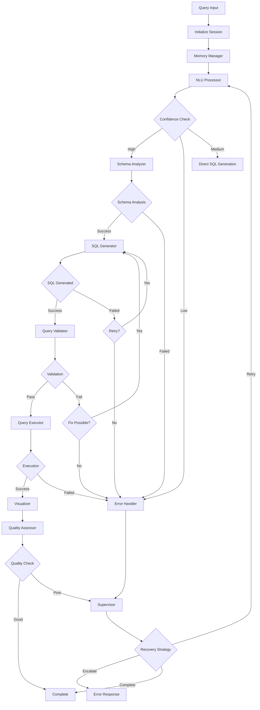

# Advanced SQL Agent System - Architecture Documentation

## 🏗️ System Overview

The Advanced SQL Agent System is a sophisticated multi-agent architecture that transforms natural language queries into optimized SQL using memory-driven intelligence, LangGraph orchestration, and specialized AI agents. The system employs a distributed agentic approach where each agent has specialized capabilities and they collaborate through a centralized workflow orchestrator.

## 🧠 Core Architectural Principles

### 1. **Multi-Agent Specialization**
Each agent is designed for a specific domain of expertise, allowing for:
- Focused optimization and expertise
- Independent development and testing
- Modular system architecture
- Specialized error handling and recovery

### 2. **Memory-Driven Intelligence**
Three-tier memory architecture enables:
- Context-aware processing
- Learning from past interactions
- User preference adaptation
- Pattern recognition and optimization

### 3. **Workflow Orchestration**
LangGraph-powered coordination provides:
- Dynamic routing based on confidence scores
- Error recovery and iteration loops
- Quality assessment checkpoints
- Parallel processing capabilities

## 🤖 Agent Architecture

### Agent Hierarchy and Roles

```
┌─────────────────────────────────────────────────────────┐
│                 WORKFLOW ORCHESTRATOR                   │
│                   (LangGraph Core)                      │
└─────────────────┬───────────────────────────────────────┘
                  │
    ┌─────────────┴─────────────┐
    │                           │
┌───▼───┐                   ┌───▼───┐
│ SUPER │                   │ ERROR │
│ VISOR │                   │HANDLER│
└───┬───┘                   └───┬───┘
    │                           │
    ▼                           ▼
┌───────────────────────────────────────────────────────┐
│              SPECIALIZED AGENTS                      │
├───────┬───────┬───────┬───────┬──────────────────────┤
│  NLU  │SCHEMA │ SQL   │VALID. │    VISUALIZATION     │
│ AGENT │ INTEL │ GEN   │& SEC  │       AGENT          │
│       │ AGENT │ AGENT │ AGENT │                      │
└───────┴───────┴───────┴───────┴──────────────────────┘
```

### 1. **Natural Language Understanding (NLU) Agent**
**Location**: `agents/nlu_agent.py`

**Responsibilities**:
- Parse natural language queries into structured intent
- Extract entities (tables, columns, metrics, filters)
- Detect ambiguities and clarification needs
- Confidence scoring for routing decisions

**Input**: Raw natural language query
**Output**: Structured intent with entities and confidence scores

**Key Workflows**:
```python
def process_query(query, context):
    # 1. Tokenization and preprocessing
    # 2. Intent classification
    # 3. Entity extraction
    # 4. Ambiguity detection
    # 5. Confidence assessment
    return {
        "query_intent": intent,
        "entities_extracted": entities,
        "ambiguities_detected": ambiguities,
        "confidence_scores": scores
    }
```

### 2. **Schema Intelligence Agent**
**Location**: `agents/schema_intelligence_agent.py`

**Responsibilities**:
- Analyze database schema for query relevance
- Score table and column relevance
- Identify relationships and joins
- Provide schema-aware optimization suggestions

**Input**: Extracted entities + database schema
**Output**: Relevant tables/columns with confidence scores

**Key Workflows**:
```python
def analyze_schema(entities, database_metadata):
    # 1. Table relevance scoring
    # 2. Column mapping and validation
    # 3. Relationship detection
    # 4. Join path optimization
    # 5. Performance considerations
    return {
        "relevant_tables": tables,
        "column_mappings": mappings,
        "suggested_joins": joins,
        "schema_confidence": confidence
    }
```

### 3. **SQL Generator Agent**
**Location**: `agents/sql_generator_agent.py`

**Responsibilities**:
- Generate SQL queries from structured intent
- Template-based query construction
- Query optimization and alternatives
- Handle complex query patterns

**Input**: Intent + schema analysis results
**Output**: Generated SQL with alternatives

**Key Workflows**:
```python
def generate_sql(intent, schema_info, memory_context):
    # 1. Template selection
    # 2. Query construction
    # 3. Optimization passes
    # 4. Alternative generation
    # 5. Complexity assessment
    return {
        "generated_sql": primary_sql,
        "alternative_queries": alternatives,
        "optimization_notes": notes,
        "confidence": confidence
    }
```

### 4. **Validation & Security Agent**
**Location**: `agents/validation_security_agent.py`

**Responsibilities**:
- SQL syntax validation
- Security vulnerability detection
- Performance analysis and optimization
- Query execution safety checks

**Input**: Generated SQL queries
**Output**: Validation results and security assessment

**Key Workflows**:
```python
def validate_query(sql, database_connector):
    # 1. Syntax validation
    # 2. Security scanning (injection, unauthorized ops)
    # 3. Performance analysis
    # 4. Resource impact assessment
    # 5. Execution safety verification
    return {
        "is_valid": boolean,
        "security_issues": issues,
        "performance_warnings": warnings,
        "validation_results": results
    }
```

### 5. **Visualization Agent**
**Location**: `agents/visualization_agent.py`

**Responsibilities**:
- Analyze query results for visualization opportunities
- Generate chart recommendations
- Create interactive dashboards
- Provide data storytelling insights

**Input**: Query results + user preferences
**Output**: Visualization specifications and rendered charts

## 🔄 Workflow Orchestration

### LangGraph State Management

The system uses LangGraph's `StateGraph` for workflow orchestration with a comprehensive state schema:

```python
class SQLAgentState(TypedDict):
    # Session Management
    session_id: str
    user_id: str
    user_query: str
    timestamp: str
    
    # Agent Coordination
    current_agent: str
    completed_agents: List[str]
    processing_stage: str
    
    # Processing Results
    query_intent: Dict
    entities_extracted: List[Dict]
    relevant_tables: List[str]
    generated_sql: str
    validation_results: Dict
    query_results: Any
    
    # Quality & Error Handling
    confidence_scores: Dict
    error_history: List[Dict]
    iteration_count: int
    quality_assessment: Dict
```

### Workflow Execution Flow



### Dynamic Routing Logic

The system employs sophisticated routing logic based on:

1. **Confidence Scores**: Route to different paths based on processing confidence
2. **Error Patterns**: Intelligent error recovery based on error history
3. **Quality Assessment**: Iterative improvement based on output quality
4. **Resource Constraints**: Consider performance and resource limitations

## 🧮 Memory Architecture

### Three-Tier Memory System

#### **Tier 1: Working Memory** (`memory/working_memory.py`)
- **Scope**: Current session processing context
- **Storage**: In-memory Python objects
- **Lifetime**: Session duration
- **Purpose**: Real-time agent coordination and data sharing

**Key Components**:
```python
class WorkingMemory:
    active_sessions = {}          # Current session data
    agent_coordination = {}       # Inter-agent communication
    processing_artifacts = {}     # Intermediate results
    agent_communications = []     # Communication logs
```

#### **Tier 2: Session Memory** (`memory/session_memory.py`)
- **Scope**: User conversation history and preferences
- **Storage**: SQLite database with secure configurations
- **Lifetime**: Persistent across sessions
- **Purpose**: User context and conversation continuity

**Database Schema**:
```sql
-- User sessions tracking
CREATE TABLE user_sessions (
    session_id TEXT PRIMARY KEY,
    user_id TEXT NOT NULL,
    created_at TIMESTAMP,
    status TEXT,
    metadata TEXT
);

-- Conversation history
CREATE TABLE conversation_history (
    id INTEGER PRIMARY KEY,
    session_id TEXT,
    user_id TEXT,
    query TEXT,
    response TEXT,
    timestamp TIMESTAMP,
    success BOOLEAN
);
```

#### **Tier 3: Long-term Memory** (`memory/long_term_memory.py`)
- **Scope**: System-wide learning and patterns
- **Storage**: SQLite + FAISS vector store
- **Lifetime**: Persistent system knowledge
- **Purpose**: Pattern learning and knowledge accumulation

**Hybrid Storage**:
- **SQLite**: Structured metadata and patterns
- **FAISS**: Vector embeddings for similarity search
- **Integration**: Vector metadata stored in SQLite with FAISS indices

### Memory Coordination

```python
class MemoryManager:
    def __init__(self):
        self.working_memory = WorkingMemory()
        self.session_memory = SessionMemory()
        self.knowledge_memory = LongTermKnowledgeMemory()
    
    async def get_contextual_memories(self, query, user_id, context_type):
        # Coordinate retrieval across all memory tiers
        working_context = await self.working_memory.get_relevant_context(...)
        session_context = await self.session_memory.get_relevant_memories(...)
        knowledge_context = await self.knowledge_memory.get_relevant_patterns(...)
        
        return self._merge_contexts(working_context, session_context, knowledge_context)
```

## 🔄 Agent Coordination Patterns

### 1. **Sequential Processing**
Agents process in defined sequence with handoff protocols:
```
NLU → Schema Intelligence → SQL Generation → Validation → Execution → Visualization
```

### 2. **Parallel Processing**
Independent operations run concurrently:
```python
async def parallel_processing():
    # Run independent validations in parallel
    syntax_check, security_scan, performance_analysis = await asyncio.gather(
        validate_syntax(sql),
        scan_security(sql),
        analyze_performance(sql)
    )
```

### 3. **Conditional Routing**
Dynamic path selection based on processing results:
```python
def route_after_nlu(state):
    confidence = state.get("confidence_scores", {}).get("overall", 0)
    if confidence > 0.8:
        return "schema_analysis"
    elif confidence > 0.5:
        return "direct_sql"
    else:
        return "clarification_needed"
```

### 4. **Error Recovery Loops**
Iterative improvement with fallback strategies:
```python
def error_recovery_strategy(state):
    error_count = len(state.get("error_history", []))
    if error_count < 3:
        return "retry_with_modifications"
    elif error_count < 5:
        return "alternative_approach"
    else:
        return "escalate_to_human"
```

## 🔒 Security Architecture

### Multi-Layer Security Model

#### **Input Validation Layer**
- User input sanitization and validation
- Length limits and type checking
- SQL injection pattern detection

#### **Database Security Layer**
- Parameterized queries exclusively
- Path traversal protection
- Secure SQLite configurations
- Foreign key constraints

#### **Agent Security Layer**
- Agent-specific input validation
- Output sanitization
- Error information filtering

#### **System Security Layer**
- Secure file permissions (0o750)
- Environment variable protection
- Access control and rate limiting

### Security Implementation

```python
class SecurityValidation:
    def validate_user_input(self, user_id, session_id, query):
        # Input validation
        if not user_id or len(user_id) > 255:
            raise ValueError("Invalid user_id")
        
        # SQL injection detection
        injection_patterns = ["'", ";", "--", "/*", "*/", "xp_", "sp_"]
        if any(pattern in query.lower() for pattern in injection_patterns):
            self.flag_potential_injection(query)
    
    def validate_database_path(self, db_path):
        # Path traversal protection
        resolved_path = Path(db_path).resolve()
        if not str(resolved_path).startswith(str(Path.cwd())):
            raise ValueError("Database path must be within working directory")
```

## 📊 Performance Optimization

### Asynchronous Processing
- All I/O operations are async
- Concurrent agent processing where possible
- Non-blocking memory operations

### Database Optimization
```python
# SQLite performance settings
PRAGMA foreign_keys = ON;
PRAGMA journal_mode = WAL;      # Write-Ahead Logging
PRAGMA synchronous = NORMAL;    # Balance safety/performance
PRAGMA temp_store = MEMORY;     # In-memory temp tables
PRAGMA cache_size = 10000;      # Large cache
```

### Vector Search Optimization
```python
# FAISS configuration for fast similarity search
def initialize_faiss_index():
    # Use Inner Product for cosine similarity
    index = faiss.IndexFlatIP(embedding_dimension)
    
    # Normalize vectors for cosine similarity
    faiss.normalize_L2(vectors)
    
    return index
```

### Caching Strategy
- Redis for session caching
- SQLite query result caching
- FAISS index caching
- Memory-based artifact caching

## 🚀 Scalability Considerations

### Horizontal Scaling
- Stateless agent design
- Database connection pooling
- Distributed caching with Redis
- Load balancing capabilities

### Vertical Scaling
- Configurable resource limits
- Memory usage monitoring
- Query timeout management
- Concurrent request limiting

### Performance Monitoring
```python
class PerformanceMonitor:
    def __init__(self):
        self.metrics = {
            "query_processing_time": [],
            "memory_usage": [],
            "agent_performance": {},
            "cache_hit_rates": {}
        }
    
    async def track_agent_performance(self, agent_name, start_time, end_time):
        processing_time = end_time - start_time
        self.metrics["agent_performance"][agent_name].append(processing_time)
```

## 🔧 Configuration and Deployment

### Environment Configuration
```env
# Core System
APP_NAME="Advanced SQL Agent System"
DEBUG_MODE=false
LOG_LEVEL="INFO"

# Database Connections
SNOWFLAKE_ACCOUNT="your-account"
SNOWFLAKE_USER="username"
SNOWFLAKE_PASSWORD="password"
SNOWFLAKE_WAREHOUSE="warehouse"
SNOWFLAKE_DATABASE="database"

# Memory System
MEMORY_BACKEND="sqlite"
SESSION_DB_PATH="data/session_memory.db"
KNOWLEDGE_DB_PATH="data/knowledge_memory.db"

# Vector Store
VECTOR_STORE_PROVIDER="faiss"
VECTOR_STORE_PATH="data/vector_store"
EMBEDDING_MODEL="all-MiniLM-L6-v2"

# LLM Configuration
LLM_PROVIDER="openai"
OPENAI_API_KEY="sk-your-key"
OPENAI_MODEL="gpt-4o"

# Performance Settings
MAX_CONCURRENT_QUERIES=10
QUERY_TIMEOUT_SECONDS=300
CACHE_TTL_SECONDS=3600
```

### Deployment Architecture
```
┌─────────────────────────────────────────────────────────┐
│                    Load Balancer                        │
└─────────────────┬───────────────────────────────────────┘
                  │
    ┌─────────────┴─────────────┐
    │                           │
┌───▼───┐                   ┌───▼───┐
│FastAPI│                   │FastAPI│
│ App 1 │                   │ App 2 │
└───┬───┘                   └───┬───┘
    │                           │
    └─────────────┬─────────────┘
                  │
    ┌─────────────▼─────────────┐
    │        Redis Cache        │
    └─────────────┬─────────────┘
                  │
    ┌─────────────▼─────────────┐
    │     SQLite + FAISS        │
    │    (Shared Storage)       │
    └───────────────────────────┘
```

## 🔍 Monitoring and Observability

### Logging Strategy
```python
# Structured logging with context
logger.info(
    "Agent processing completed",
    extra={
        "agent_name": agent_name,
        "session_id": session_id,
        "processing_time": processing_time,
        "success": success,
        "confidence": confidence_score
    }
)
```

### Metrics Collection
- Agent performance metrics
- Memory usage tracking
- Query processing times
- Error rates and patterns
- Cache hit/miss ratios

### Health Checks
```python
async def system_health_check():
    checks = {
        "database_connectivity": await check_database(),
        "memory_system": await check_memory_health(),
        "agent_availability": await check_agents(),
        "cache_status": await check_cache()
    }
    return {"status": "healthy" if all(checks.values()) else "degraded", "checks": checks}
```

## 🧪 Testing Strategy

### Unit Testing
- Individual agent testing
- Memory system testing
- Workflow component testing
- Security validation testing

### Integration Testing
- End-to-end workflow testing
- Multi-agent coordination testing
- Database integration testing
- Error recovery testing

### Performance Testing
- Load testing with concurrent requests
- Memory usage under stress
- Cache performance testing
- Agent processing benchmarks

This architecture provides a robust, scalable, and secure foundation for the Advanced SQL Agent System, enabling sophisticated natural language to SQL translation through intelligent agent coordination and memory-driven learning.